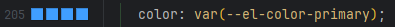
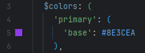

## 关于使用全局变量定义样式的注意事项
>使用全局变量时,
>编辑器显示的颜色可能不准确, 请自行检查,
>或者查看styles/variables.scss文件
>--------------------------------------------------------
>例如：color: var(--el-color-primary), 编辑器显示为蓝色,
> 
>
> 实际可能是紫色，具体看variables.scss文件内的定义
> 

## 代码提交规范

一定要加上scope标注所属包名，比如：

- feat(utils): 新增防抖节流函数
- fix(ui): 修复table组件
- docs(root): 编写readme文档
- style(模块名)：代码格式更改
- refactor(模块名)：代码重构更改
- perf(模块名)：性能优化更改
- test(模块名)：测试改动相关更改
- build(模块名)：构建流程、外部依赖变更
- ci(模块名)：修改CI配置、脚本变更
- chore(模块名)：回滚commit变更
- revert(模块名)：撤销commit变更
